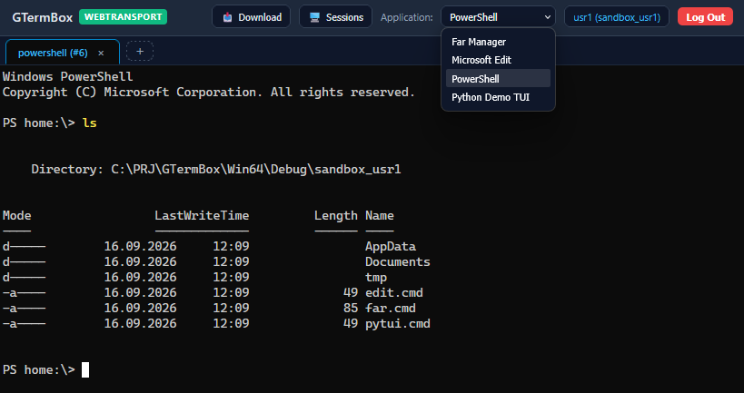

# GTermBox – Sandboxed WebTerminal

GTermBox is a secure web terminal gateway that streams native Windows console applications (such as PowerShell, Python TUI, and command-line editors) directly into modern web browsers over HTTP/3 WebTransport.



---

## Key Features

*   **Transport & Networking:**
    *   **WebTransport / HTTP/3 (QUIC RFC 9220):** Bidirectional streaming via `msquic.dll` and `ls-qpack.dll`. Hardware-accelerated TLS 1.3 AEAD, zero-polling I/O.
    *   **HTTPS (SChannel SSPI):** Native Windows TLS 1.3/1.2 stack, zero OpenSSL dependency.
    *   **W3C Cert Fingerprinting:** Automated SHA-256 hash negotiation (`/api/certificate-hash`, W3C Section 3.3).
*   **Sandbox & Isolation:**
    *   **Windows AppContainer (`smStandard`):** Restricted SID tokens; isolated filesystem, registry, and network namespaces.
    *   **Capability SIDs:** Granular outbound networking (`S-1-15-3-1` Internet, `S-1-15-3-3` Private LAN).
    *   **DACL Management:** Dynamic directory inheritance (`allowedDirs` RX, `allowedDirsWrite` RW).
    *   **Windows Job Object:** Hard memory limit (512 MB commit), CPU throttling, recursive `JOB_OBJECT_LIMIT_KILL_ON_JOB_CLOSE`.
    *   **Admin Mode (`smJobOnly`):** Unrestricted filesystem access with Job Object quota enforcement.
*   **Security & RBAC:**
    *   **JWT Authentication:** HMAC-SHA256 Bearer tokens carrying identity, role, and grant claims.
    *   **Role Enforcement:** `admin` vs `user` app filtering; HTTP 403 on unauthorized launch.
    *   **Session Management:** Live introspection (`GET /api/admin/sessions`) and termination (`POST /api/admin/sessions/kill`).
*   **Web Client (xterm.js):**
    *   **Multi-Session Engine:** Independent concurrent tabs via `TabManager`.
    *   **Terminal Emulation:** 24-bit TrueColor, VT100/VT220, native clipboard paste.
    *   **Control Sequences:** Passthrough for `Ctrl+O` (0x0F), `Ctrl+S` (0x13), `Ctrl+P` (0x10).
    *   **File Transfer:** Drag-and-drop upload to sandbox; direct download via `/api/sandbox/file`.

---

## Requirements & Dependencies

Detailed system requirements, Delphi compiler versions (Win64), native binaries (`msquic.dll`, `ls-qpack.dll`), and core framework dependencies (`QuickLib`, `QuickLogger`, `FastMM5`, `GHttpsIOCPSvr`) are documented in [GHttpsIOCPSvr Requirements & Dependencies](https://github.com/gecko-71/GHttpsIOCPSvr/blob/main/README.md).

---

## Frontend Dependencies: web/lib/

Client files are bundled in `web/lib/` by default:
*   `xterm.js` (v5.5.0)
*   `xterm.css` (v5.5.0)
*   `addon-fit.js` (v0.10.0)

To re-download or update them via PowerShell:
```powershell
New-Item -ItemType Directory -Force -Path "web\lib"
Invoke-WebRequest -Uri "https://cdn.jsdelivr.net/npm/@xterm/xterm@5.5.0/lib/xterm.js" -OutFile "web\lib\xterm.js"
Invoke-WebRequest -Uri "https://cdn.jsdelivr.net/npm/@xterm/xterm@5.5.0/css/xterm.css" -OutFile "web\lib\xterm.css"
Invoke-WebRequest -Uri "https://cdn.jsdelivr.net/npm/@xterm/addon-fit@0.10.0/lib/addon-fit.js" -OutFile "web\lib\addon-fit.js"
```

---

## Getting Started: Running the Server

### 1. SSL/TLS Certificate for WebTransport
Follow the W3C certificate generation guide in [GHttpsIOCPSvr Certificate Management](https://github.com/gecko-71/GHttpsIOCPSvr/blob/main/README.md) (run `.\GHttpsIOCPSvr\gen_w3c_wt_cert.ps1` as Administrator).

### 2. Build the Project
Open and compile `GTermBoxServer.dproj` (or `GTermBoxServer.dpr`) and `ManageUsers.dproj` (or `ManageUsers.dpr`) in RAD Studio / Delphi for **Win64 Debug** or **Win64 Release**. Both projects are bundled together in `GTermBoxtGroup.groupproj`.

### 3. Launch the Server
Run `Win64\Debug\GTermBoxServer.exe`.

The server will initialize and listen on:
*   **HTTPS / WebTransport:** `https://localhost:8443`

---

## Application Binaries & Environments: Far, Edit, and PyTui

GTermBox comes pre-configured to stream Far Manager, Microsoft Edit, and a Python Demo TUI. Follow the instructions below to download pre-built binaries, build from source, or set up virtual environments.

### 1. Far Manager (`Win64\Debug\Far\Far.exe`)

*   **Option A: Download Pre-built Binaries (Recommended):**
    1. Download the latest 64-bit portable archive (`Far30b*.x64.*.7z` or `.zip`) from [Far Manager Official Downloads](https://www.farmanager.com/download.php) or [FarGroup GitHub Releases](https://github.com/FarGroup/FarManager/releases).
    2. Alternatively, install via WinGet:
       ```powershell
       winget install FarGroup.FarManager
       ```
    3. Extract/copy all files into `Win64\Debug\Far\` so that `Far.exe`, `FarEng.lng`, `lua51.dll`, `sqlite3.dll`, and `Plugins\` reside directly inside `Win64\Debug\Far\`.

*   **Option B: Build from Source:**
    1. Prerequisites: Visual Studio (MSVC C++ toolchain) and CMake.
    2. Clone the repository:
       ```cmd
       git clone https://github.com/FarGroup/FarManager.git
       cd FarManager
       ```
    3. Configure and build 64-bit release:
       ```cmd
       cmake -B build -A x64
       cmake --build build --config Release
       ```
    4. Copy the generated files from `build\bin\` into `Win64\Debug\Far\`.

---

### 2. Microsoft Edit (`Win64\Debug\Edit\edit.exe`)

*   **Option A: Download Pre-built Binary (Recommended):**
    1. Download the latest `edit.exe` Windows binary from [Microsoft Edit GitHub Releases](https://github.com/microsoft/edit/releases/latest).
    2. Alternatively, install via WinGet:
       ```powershell
       winget install Microsoft.Edit
       ```
    3. Place `edit.exe` into `Win64\Debug\Edit\edit.exe`.

*   **Option B: Build from Source:**
    1. Prerequisites: Rust toolchain installed via [rustup.rs](https://rustup.rs/).
    2. Clone the repository (or navigate to `MsEdit\edit` in the workspace):
       ```cmd
       git clone https://github.com/microsoft/edit.git MsEdit\edit
       cd MsEdit\edit
       ```
    3. Compile using Cargo (Release mode):
       ```cmd
       cargo build --release
       ```
       *(Optional: To optimize binary size, run `set RUSTC_BOOTSTRAP=1` followed by `cargo build --release --config .cargo/release.toml`)*.
    4. Copy the compiled binary `target\release\edit.exe` to `Win64\Debug\Edit\edit.exe`.

---

### 3. Python Demo TUI (`Win64\Debug\PyTui\`) & Virtual Environment

The Python TUI demo runs through a batch wrapper (`run.cmd`) that sets the active console code page to UTF-8 (`@chcp 65001 >nul`) and launches Python using a local virtual environment:

1. **Prerequisites:** Python 3.10+ installed on the host system and available on your `PATH`.
2. **Setup Virtual Environment:**
   From the repository root, create the virtual environment in `Win64\Debug\PyTui\venv`:
   ```powershell
   python -m venv Win64\Debug\PyTui\venv
   ```
   *(Or navigate into `Win64\Debug\PyTui` and run `python -m venv venv`)*.
3. **Directory Structure:**
   The `Win64\Debug\PyTui` folder should contain:
   ```text
   Win64\Debug\PyTui\
   ├── app.py                     # Python TUI application script
   ├── run.cmd                    # ConPTY launch wrapper (@chcp 65001 + venv\Scripts\python.exe)
   └── venv\                      # Local virtual environment
       └── Scripts\
           └── python.exe         # Isolated Python runtime
   ```
4. **Custom Dependencies:**
   If you extend `app.py` or add new scripts requiring third-party pip packages (e.g. `rich`, `textual`), install them directly into this virtual environment:
   ```cmd
   Win64\Debug\PyTui\venv\Scripts\pip.exe install <package_name>
   ```

---

## Configuration Architecture

### 1. Default Credentials & Authentication
Authentication is stateless and managed via HTTP POST `/api/login`:
*   **Password Verification:** Verified against individual cryptographic salts using SHA-256:
    $$\text{passwordHash} = \text{SHA-256}(\text{salt} + \text{":"} + \text{password})$$
    When the lowercase hex digest matches `passwordHash`, the server issues a cryptographically signed JWT Bearer token carrying user identity, role, sandbox path, client IP binding, and permitted applications.
*   **Token Verification:** Bearer tokens are validated on every REST API request and verified against client IP during the WebTransport QUIC handshake.
*   **Pre-configured Accounts & Hashing Walkthrough:**
    *   **`usr1`** (`role: "user"`, password: `1234`):
        *   `salt`: `"salt_usr1_8f2a1b9c3e"` (generated with high-entropy OS random bytes)
        *   `password`: `"1234"`
        *   Input to SHA-256: `"salt_usr1_8f2a1b9c3e:1234"`
        *   `passwordHash`: `"96e90211ce9ca78a7c3f2961ffc22fe4f7547f7172cdea6ec69ecaf3f37e51f1"`
        *   Standard unprivileged account restricted to AppContainer sandbox (`sandbox_usr1`) and standard apps (`far`, `edit`, `powershell`, `pytui`).
    *   **`admin`** (`role: "admin"`, password: `1234`):
        *   `salt`: `"salt_admin_7951d215c4"`
        *   `password`: `"1234"`
        *   Input to SHA-256: `"salt_admin_7951d215c4:1234"`
        *   `passwordHash`: `"ce20232d96aa0651ef8b56fb8abb831d83f2b17dabcb612a30075cb4d062bf57"`
        *   Full administrator account authorized for wildcard applications (`apps: ["*"]`), job-only administrative shells (`admin-powershell`), and session introspection (`/api/admin/*`).
*   **Cryptographic Properties:**
    *   **Rainbow Table Immunity:** Even though `admin` and `usr1` share the same default password (`1234`), their stored `passwordHash` values are completely different because each account possesses a unique cryptographic salt.
    *   **Automated Salt Rotation:** Changing a password via `ManageUsers passwd <user> <new_password>` automatically generates a fresh random salt, recalculating the hash and protecting against replay attacks.

---

### 2. `apps.json` — Application Profiles
Defines the registry of executable console applications streamed via ConPTY:

```json
{
  "apps": [
    {
      "id": "far",
      "name": "Far Manager",
      "command": "Far\\Far.exe",
      "args": ["-s", "%SANDBOX%\\profile", "%SANDBOX%", "%SANDBOX%"],
      "env": ["TERM=xterm-256color", "COLORTERM=truecolor"],
      "cols": 160,
      "rows": 38,
      "sandbox": "standard",
      "roles": ["user", "admin"]
    },
    {
      "id": "edit",
      "name": "Microsoft Edit",
      "command": "Edit\\edit.exe",
      "args": [],
      "env": ["TERM=xterm-256color", "COLORTERM=truecolor"],
      "cols": 120,
      "rows": 40,
      "sandbox": "standard",
      "roles": ["user", "admin"]
    },
    {
      "id": "powershell",
      "name": "PowerShell",
      "command": "powershell.exe",
      "args": [],
      "env": ["TERM=xterm-256color", "COLORTERM=truecolor"],
      "cols": 120,
      "rows": 30,
      "sandbox": "standard",
      "roles": ["user", "admin"]
    },
    {
      "id": "pytui",
      "name": "Python Demo TUI",
      "command": "PyTui\\run.cmd",
      "args": [],
      "env": [
        "TERM=xterm-256color",
        "COLORTERM=truecolor",
        "PYTHONIOENCODING=utf-8",
        "PYTHONUTF8=1"
      ],
      "cols": 120,
      "rows": 30,
      "sandbox": "standard",
      "roles": ["user", "admin"]
    },
    {
      "id": "admin-powershell",
      "name": "PowerShell Administrator",
      "command": "powershell.exe",
      "args": [],
      "env": [
        "TERM=xterm-256color",
        "COLORTERM=truecolor"
      ],
      "cols": 120,
      "rows": 30,
      "sandbox": "job-only",
      "network": true,
      "allowedDirs": [],
      "allowedDirsWrite": [],
      "roles": [
        "admin"
      ]
    }
  ]
}
```

#### Parameter Reference (`apps.json`):
*   **`id`** *(string)*: Unique application identifier passed in session creation (`POST /api/terminal/session`).
*   **`name`** *(string)*: Display name rendered in the frontend application selector dropdown.
*   **`command`** *(string)*: Executable file path or script wrapper (relative to server root or absolute system path). Supports binary executables (`.exe`) as well as shell/batch scripts (`.cmd`, `.bat`).
*   **`args`** *(array of strings)*: Command-line arguments passed to the spawned process.
*   **`env`** *(array of strings)*: Environment variables injected into the process environment block (`KEY=VALUE`).
*   **`cols` / `rows`** *(integer)*: Default virtual pseudo-console screen buffer dimensions for ConPTY.
*   **`sandbox`** *(string)*: Process isolation mode:
    *   `"standard"` (`smStandard`): Windows AppContainer with restricted token SID and private directory isolation.
    *   `"job-only"` (`smJobOnly`): Windows Job Object with RAM/CPU quota enforcement without AppContainer isolation (admin mode).
    *   `"none"` (`smNone`): Direct execution under the host server context.
*   **`network`** *(boolean, optional)*: Outbound network capability:
    *   `true`: Grants `S-1-15-3-1` (`WinCapabilityInternetClientSid`) and `S-1-15-3-3` (`WinCapabilityPrivateNetworkClientServerSid`).
    *   `false`: Completely blocks network capabilities at the Windows kernel level.
*   **`allowedDirs`** *(array of strings, optional)*: Directory paths dynamically granted read/execute DACL access (`GENERIC_READ | GENERIC_EXECUTE`) for the AppContainer SID.
*   **`allowedDirsWrite`** *(array of strings, optional)*: Directory paths dynamically granted full read/write DACL access (`GENERIC_ALL`) for the AppContainer SID.
*   **`roles`** *(array of strings, optional)*: RBAC roles authorized to enumerate and launch this application (`["user", "admin"]`). Defaults to `["admin", "user"]` if omitted.

#### Scripts and Batch Execution Wrappers (`.cmd`, `.bat`)
GTermBox ConPTY engine natively supports executing Windows batch scripts as application targets:
*   **Use Cases:** Script wrappers allow setting up virtual environments, configuring Windows code pages (such as `@chcp 65001 >nul` for UTF-8), or chaining startup commands prior to launching interactive TUIs (e.g. `PyTui\run.cmd`).
*   **Environment Injections:** Scripts can receive tailored environment variables declared in `apps.json` (such as `PYTHONIOENCODING=utf-8` and `PYTHONUTF8=1`) to guarantee lossless UTF-8 multibyte character, box-drawing, and emoji streaming across xterm.js.

#### Administrative Shell (`admin-powershell`) & Job-Only Sandbox
For administrative operations, GTermBox provides an elevated shell profile with specific security controls:
*   **Role Restriction:** Explicitly locked to `"roles": ["admin"]`. Standard users cannot view this profile in `/api/apps` or spawn it (enforced via HTTP 403 Forbidden).
*   **Job-Only Sandbox (`smJobOnly`):** Executes outside the restricted AppContainer security token, granting access to host system tools, directories, and management commands, while remaining governed by the Windows Job Object (enforcing strict memory quotas and clean, recursive process tree termination upon session disconnect).
*   **Network Access:** Outbound networking is enabled (`"network": true`) for remote management and administrative tasks.
*   **User Grants Verification:** Launching a `job-only` application requires the user account to have `allowJobOnly: true` (granted by default to `role: "admin"`).

---

### 3. `users.json` — RBAC & Sandbox Grants
Defines user identities, authentication hashes, and granular security overrides:

```json
{
  "users": [
    {
      "username": "usr1",
      "role": "user",
      "salt": "salt_usr1_8f2a1b9c3e",
      "passwordHash": "96e90211ce9ca78a7c3f2961ffc22fe4f7547f7172cdea6ec69ecaf3f37e51f1",
      "sandbox": "sandbox_usr1",
      "apps": ["far", "edit", "powershell", "pytui"]
    },
    {
      "username": "admin",
      "role": "admin",
      "salt": "salt_admin_7951d215c4",
      "passwordHash": "ce20232d96aa0651ef8b56fb8abb831d83f2b17dabcb612a30075cb4d062bf57",
      "sandbox": "sandbox_admin",
      "apps": ["*"],
      "grants": {
        "network": true,
        "allowJobOnly": true,
        "fullDiskAccess": true,
        "allowedDirsRead": [],
        "allowedDirsWrite": []
      }
    }
  ]
}
```

#### Parameter Reference (`users.json`):
*   **`username`** *(string)*: Unique login identifier.
*   **`role`** *(string)*: Primary RBAC role (`"admin"` or `"user"`). Embedded as a claim into JWT tokens.
*   **`salt`** *(string)*: Cryptographic per-user salt in the format `salt_<username>_<random_hex>` generated with OS-level high-entropy randomness (`TGUID.NewGuid` in Delphi). Prevents rainbow table attacks and guarantees distinct hashes across users with identical passwords.
*   **`passwordHash`** *(string)*: 64-character lowercase hex digest of `SHA-256(salt + ":" + password)`. Computed natively by Delphi (`THashSHA2.GetHashString`).
*   **`sandbox`** *(string)*: Dedicated directory relative to server root assigned as process `Cwd` and granted exclusive read/write DACL permissions for the user's AppContainer profile.
*   **`apps`** *(array of strings)*: Whitelist of allowed application IDs. Supports wildcard `["*"]` to inherit all applications permitted by the user's role.
*   **`grants`** *(object, optional)*: Fine-grained security overrides evaluated during session establishment:
    *   **`network`** *(boolean)*: User-level network override. Effective network access is computed as `app.network AND user.grants.network`.
    *   **`allowJobOnly`** *(boolean)*: Authorizes execution of `sandbox: "job-only"` profiles (automatically true for `role: "admin"`).
    *   **`fullDiskAccess`** *(boolean)*: Grants bypass of restricted directory isolation.
    *   **`allowedDirsRead`** *(array of strings)*: Additional read-only directory paths merged with the application's `allowedDirs`.
    *   **`allowedDirsWrite`** *(array of strings)*: Additional write-enabled directory paths merged with the application's `allowedDirsWrite`.

---

### 4. User & Application Management Tool (`ManageUsers.dpr` / `ManageUsers.exe`)
GTermBox includes a dedicated, zero-dependency native Delphi console utility (`ManageUsers.dpr` / `ManageUsers.exe`) located in the root workspace alongside `GTermBoxServer.dpr`.

#### Operational Model
*   **Self-Contained & Native:** Executes natively on 64-bit Windows without requiring Python or external runtime dependencies. All configuration management takes place directly inside `ManageUsers.dpr` / `ManageUsers.exe`.
*   **Local File Discovery:** Reads and writes `users.json` and `apps.json` directly from the directory where the `.exe` resides (`ExtractFilePath(ParamStr(0))`). When deployed to `Win64\Debug\`, it operates on `Win64\Debug\users.json` and `Win64\Debug\apps.json`.
*   **Automatic Incremental Backups:** Before every file modification, it automatically creates a versioned backup (`users_v1.json`, `users_v2.json`, `apps_v1.json`, etc.).
*   **Clean UTF-8:** Serializes JSON in pure UTF-8 without BOM (`0xEF, 0xBB, 0xBF`), ensuring seamless interoperability with web servers, external tools, and JSON parsers.

#### Usage Modes

##### 1. Interactive Menu Mode
Run `ManageUsers.exe` with no command-line arguments to launch the interactive console management menu:
```text
=== GTermBox Management Tool ===
--- User Management (users.json) ---
1. List users
2. Add new user
3. Edit user parameters (role, apps, sandbox, grants)
4. Change user password
5. Delete user
--- Application Management (apps.json) ---
6. List applications
7. Add new application
8. Edit application parameters
9. Delete application
0. Exit

Select option [1-9, 0]:
```

##### 2. Command-Line (CLI) Automation
For automated deployments, DevOps, and scripting, `ManageUsers.exe` supports full subcommand automation:

*   **User Management:**
    *   `ManageUsers list` — Display a formatted table of all registered users, roles, sandboxes, and granted capabilities.
    *   `ManageUsers add <username> <password> [options]` — Create or update a user account. Options:
        *   `--role <admin|user>` (default: `user`)
        *   `--apps <app1,app2|*>` (comma-separated allowed apps or wildcard `*`)
        *   `--sandbox <dirname>` (custom sandbox directory, default: `sandbox_<username>`)
        *   `--no-network` (disable network access for AppContainer)
        *   `--allow-job-only` (authorize job-only administrative shells)
        *   `--dirs-read <dir1,dir2>` (extra read-only directory paths)
        *   `--dirs-write <dir1,dir2>` (extra read/write directory paths)
    *   `ManageUsers edit <username> [options]` — Modify an existing user's parameters and grants (`--role`, `--sandbox`, `--apps`, `--network`, `--no-network`, `--allow-job-only`, `--no-job-only`, `--dirs-read`, `--dirs-write`).
    *   `ManageUsers passwd <username> <new_password>` — Generate a new high-entropy cryptographic salt and recalculate `SHA-256(salt + ":" + password)`.
    *   `ManageUsers delete <username>` — Remove a user account from `users.json`.

*   **Application Management:**
    *   `ManageUsers list-apps` — Display all registered application profiles, commands, virtual screen geometries, sandbox isolation modes, and permitted roles.
    *   `ManageUsers add-app <id> <name> <command> [options]` — Register a new application or script wrapper. Options:
        *   `--args <arg1,arg2>` (comma-separated argument list)
        *   `--working-dir <path>` (custom working directory)
        *   `--env <KEY1=VAL1,KEY2=VAL2>` (custom environment variable overrides)
        *   `--cols <N>` / `--rows <N>` (virtual console dimensions, e.g. `120`x`30`)
        *   `--sandbox <standard|job-only|none>` (process isolation mode)
        *   `--network` / `--no-network` (outbound network access in AppContainer)
        *   `--dirs-read <dir1,dir2>` / `--dirs-write <dir1,dir2>` (extra directories)
        *   `--roles <role1,role2>` (permitted roles, default: `admin,user`)
    *   `ManageUsers edit-app <id> [options]` — Update parameters of an existing application profile.
    *   `ManageUsers delete-app <id>` — Remove an application profile from `apps.json`.

---

## License

This project is licensed under the **MIT License**. See source headers for details.

Copyright (c) 2026 GECKO-71.
